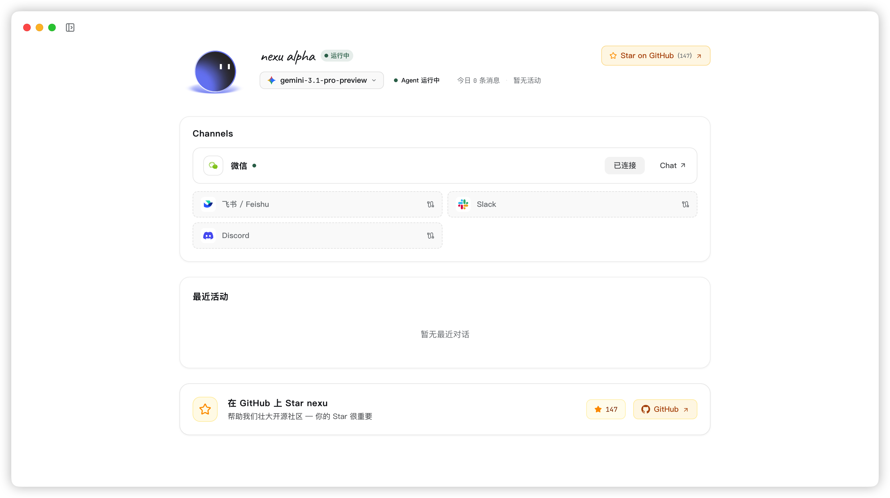
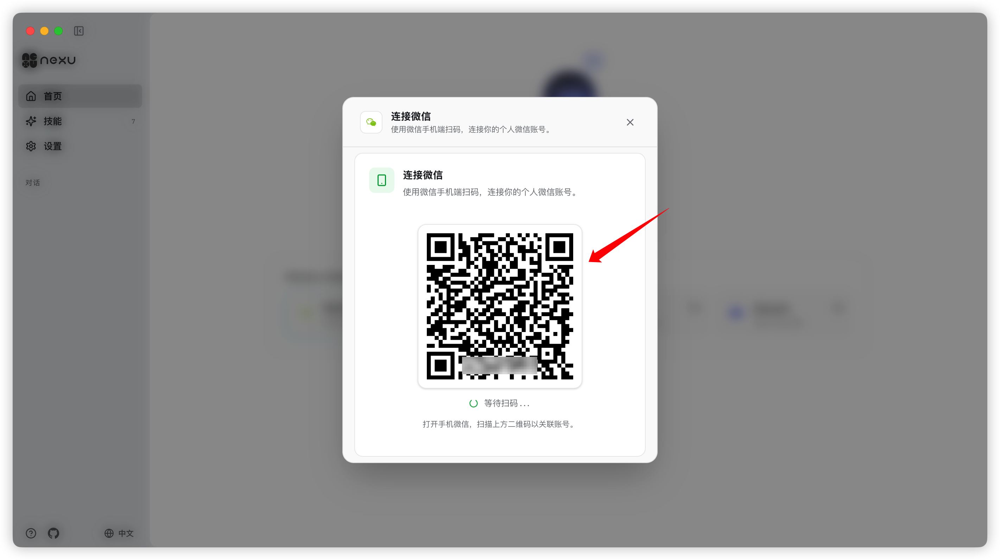

<p align="center">
  
</p>

<h1 align="center">nexu</h1>

<p align="center">
  <strong>最简单的微信 & 飞书 OpenClaw 🦞 开源桌面客户端</strong>
</p>

<p align="center">
  <a href="https://github.com/nexu-io/nexu/releases"></a>
  <a href="https://github.com/nexu-io/nexu/blob/main/LICENSE"></a>
</p>

<p align="center">
  <a href="https://nexu.io" target="_blank" rel="noopener"><strong>🌐 官网</strong></a> &nbsp;·&nbsp;
  <a href="https://docs.nexu.io" target="_blank" rel="noopener"><strong>📖 文档</strong></a> &nbsp;·&nbsp;
  <a href="https://github.com/nexu-io/nexu/discussions"><strong>💬 Discussions</strong></a> &nbsp;·&nbsp;
  <a href="https://github.com/nexu-io/nexu/issues"><strong>🐛 Issues</strong></a> &nbsp;·&nbsp;
  <a href="https://x.com/nexudotio" target="_blank" rel="noopener"><strong>𝕏 Twitter</strong></a>
</p>

<p align="center">
  <a href="README.md">English</a> &nbsp;·&nbsp; 简体中文 &nbsp;·&nbsp; <a href="README.ja.md">日本語</a>
</p>

---

> 🎉 **内测福利**：内测期间，Claude、GPT、Gemini、Kimi、GLM 等顶级模型 **全部免费、无限量使用**。[立即下载体验 →](https://nexu.io)

---

## 📋 概述

**nexu**（奈苏，next to you）是一个开源桌面客户端，让你的 **OpenClaw 🦞** Agent 直接运行在微信、飞书、Slack、Discord 等 IM 中。

**已支持微信接入 OpenClaw** —— 适配微信 8.0.7 OpenClaw 插件，点击连接、微信扫码，即可在微信中与 AI Agent 对话。

下载即用，图形化配置，内置飞书 Skills，支持 Claude / GPT / Gemini 等多模型与自带 API Key。

连接 IM 后，Agent 7×24 小时在线——手机上随时对话，不受桌面限制。

所有数据保存在本机，隐私安全，完全可控。

<p align="center">
  
  &nbsp;
  
</p>

---

## 📊 与常见方案的区别

| | OpenClaw 官方 | 典型托管飞书龙虾方案 | **nexu** ✅ |
|---|---|---|---|
| **🧠 模型** | 自选，但需手动配置 ⚠️ | 平台指定，不可更换 ❌ | **自选 Claude / GPT / Gemini 等，GUI 一键切换** ✅ |
| **📡 数据路径** | 本地 | 经第三方服务器，数据不可控 ❌ | **本机为主，不托管你的业务数据** ✅ |
| **💰 费用** | 免费，但需自行部署 ⚠️ | 订阅 / 按席收费 ❌ | **客户端免费，按自备 API Key 计费** ✅ |
| **📜 源码** | 开源 | 闭源，无法审计 ❌ | **MIT 开源，可 fork、可审计** ✅ |
| **🔗 渠道** | 需自行对接 ⚠️ | 视产品而定，常有限制 ❌ | **内置微信、飞书、Slack、Discord，开箱即用** ✅ |
| **🖥 使用方式** | CLI，需技术背景 ❌ | 视产品而定 | **纯 GUI，无需 CLI，双击即用** ✅ |

---

## 功能要点

### 🖱 双击安装

下载、双击、开始使用。无需环境变量、无需折腾依赖、无需长文档。nexu 的首次体验与能力一致——开箱即用。

### 🔗 内置 OpenClaw 🦞 Skills + 完整飞书 Skills

原生 OpenClaw 🦞 Skills 与完整飞书 Skills 一并提供。Agent 不再停留在演示，而是直接进入团队真实工作流，无需额外集成。

### 🧠 顶级模型，开箱即用

通过 nexu 账号直接使用 Claude 4.6、ChatGPT 5.4、Minimax 2.5、GLM 5.0、Kimi 2.5 等模型，无需额外配置。也可随时切换为自带 API Key。

### 🔑 支持自带 API Key，无需登录

更倾向自己的模型服务？填入 API Key 即可使用，无需注册、无需登录。

### 📱 连接 IM，移动端即用

连接微信、飞书、Slack 或 Discord，你的 AI Agent 立刻出现在手机上。无需额外 App——打开微信或团队聊天工具，随时随地和 Agent 对话。

### 👥 为团队而生

核心开源，同时提供真正可用的桌面体验，兼容团队已有的工具与模型栈。

---

## 使用场景

nexu 面向 **One Person Company** 与小团队，让一个人就能拥有一支 AI 团队。

### 🛒 一人电商 / 跨境电商

> *"以前写 3 种语言的商品详情要花整个周末。现在我在飞书里把产品参数发给 Agent，一杯咖啡的功夫，亚马逊、Shopee、TikTok Shop 的 listing 就全好了。"*

选品调研、竞品比价、商品标题优化、多语言营销素材生成——从一周压缩到一个下午。

### ✍️ 知识博主 / 自媒体

> *"周一早上，我在 Slack 里问 Agent 这周有什么热点。午饭前，小红书、公众号、Twitter 的 5 篇初稿就出来了——每篇都是对应平台的调性。"*

热点追踪、选题生成、多平台内容批量产出、评论区互动——一个人运营矩阵账号。

### 💻 独立开发者

> *"凌晨 3 点排 Bug？我把报错堆栈贴到 Discord，Agent 定位到一个竞态条件，给出修复方案，连 PR 描述都帮我写好了。永不下线的结对编程。"*

代码审查、文档生成、Bug 分析、重复任务自动化——Agent 就是你的结对编程搭档。

### ⚖️ 法律 / 财税 / 咨询

> *"客户在飞书发来一份 40 页合同。我转发给 Agent——10 分钟后收到风险摘要、标记条款和修改建议。以前半天的活儿，现在一杯咖啡的时间。"*

合同审阅、法规检索、报表生成、客户问答——把专业知识变成 Agent 的技能。

### 🏪 门店 / 本地商家

> *"半夜客户发消息问'这个还有货吗？'我飞书里的 Agent 自动回复实时库存，处理退换，还顺手发了张优惠券。我终于能安心睡觉了。"*

库存管理、订单跟进、客户消息自动回复、营销文案生成——让 AI 帮你看店。

### 🎨 设计 / 创意

> *"我在 Slack 里丢了一句简单的 brief：'宠物食品品牌落地页，活泼风格。'Agent 回了文案方案、配色建议和参考图——全在启动会之前搞定。"*

需求拆解、素材检索、文案撰写、设计稿标注——释放创意时间，减少重复劳动。

---

## 🚀 快速开始

### 系统要求

- 🍎 **系统**：macOS 12+（Apple Silicon）
- 💾 **磁盘**：约 500 MB

### 安装

**推荐：直接下载 Mac 客户端**

1. 打开 [官网](https://nexu.io) 或 [Releases](https://github.com/nexu-io/nexu/releases) 📥
2. 下载 Mac 安装包
3. 启动 nexu 🎉

> ⏳ **Windows 与 macOS Intel**：开发中。如需进展可邮件 [support@nexu.ai](mailto:support@nexu.ai)。

### 首次启动

使用 nexu 账号登录，立即使用已支持的模型；也可添加自带 API Key，无需账号即可使用 🔑。

---

## 🛠 开发

### 前置条件

- **Node.js** 22+（推荐 LTS）
- **pnpm** 10+

### 项目结构（节选）

```
nexu/
├── apps/
│   ├── api/              # 后端 API
│   ├── web/              # Web 前端
│   ├── desktop/          # 桌面客户端（Electron）
│   └── controller/       # 控制器
├── packages/shared/      # 共享库
├── docs/                 # 文档
├── tests/
└── specs/
```

### 常用命令

```bash
pnpm run dev             # 开发环境（热重载）
pnpm run dev:desktop     # 桌面客户端
pnpm run build           # 生产构建
pnpm run lint
pnpm test
```

---

## 🤝 贡献

欢迎贡献！**英文权威指南**在仓库根目录 [CONTRIBUTING.md](CONTRIBUTING.md)（GitHub 发起 PR 时会重点展示）。文档站会同步嵌入该文件：[docs.nexu.io — Contributing](https://docs.nexu.io/guide/contributing)。**中文指南：** [docs.nexu.io 参与贡献](https://docs.nexu.io/zh/guide/contributing) · [docs/zh/guide/contributing.md](docs/zh/guide/contributing.md)。

1. 🍴 Fork 本仓库
2. 🌿 创建功能分支（`git checkout -b feature/amazing-feature`）
3. 💾 提交改动（`git commit -m 'Add amazing feature'`）
4. 📤 推送到分支（`git push origin feature/amazing-feature`）
5. 🔀 提交 Pull Request

### 规范

- 遵循现有代码风格（Biome，可运行 `pnpm lint`）
- 为新功能编写测试
- 按需更新文档
- 保持提交原子化且描述清晰

---

## 💬 社区

我们以 GitHub 作为社区交流的主要阵地。发帖前请先搜索，避免重复。

| 渠道 | 适用场景 |
|------|----------|
| 💡 [**Discussions**](https://github.com/nexu-io/nexu/discussions) | 提问、提想法、分享使用场景，或者打个招呼。**Q&A** 分类适合排查问题，**Ideas** 分类适合功能脑暴。 |
| 🐛 [**Issues**](https://github.com/nexu-io/nexu/issues) | 提交 Bug 或具体的功能需求。请使用 Issue 模板，方便我们快速分类处理。 |
| 📋 [**Roadmap & RFCs**](https://github.com/nexu-io/nexu/discussions/categories/rfc-roadmap) | 关注产品规划，参与重大设计方案的讨论。 |
| 📧 [**support@nexu.ai**](mailto:support@nexu.ai) | 私密咨询、商务合作，或不适合公开讨论的事项。 |

### Contributors

<a href="https://github.com/nexu-io/nexu/graphs/contributors">
  
</a>

---

## ⭐ Star History

<a href="https://star-history.com/#nexu-io/nexu&Date">
 <picture>
   <source media="(prefers-color-scheme: dark)" srcset="https://api.star-history.com/svg?repos=nexu-io/nexu&type=Date&theme=dark" />
   <source media="(prefers-color-scheme: light)" srcset="https://api.star-history.com/svg?repos=nexu-io/nexu&type=Date" />
   
 </picture>
</a>

---

## 📄 许可证

nexu 基于 [MIT License](LICENSE) 开源——你可以自由使用、修改、分发。

我们相信开源是 AI 基础设施的未来。欢迎 fork、贡献、或基于 nexu 构建你自己的产品。

---

<p align="center">Built with ❤️ by the nexu Team</p>
