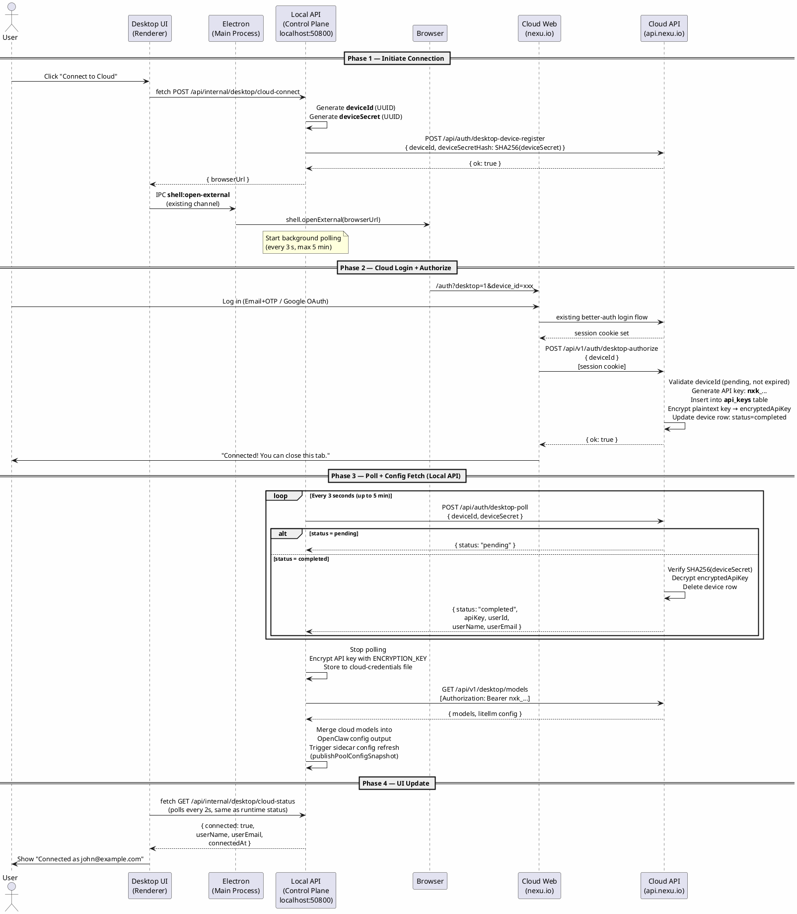

# Desktop Cloud Connection

## 1. Overview

The Nexu desktop client (Electron) currently runs fully offline with a local PGlite database and hardcoded seed user. This design adds a "Connect to Cloud" capability so desktop users can link their cloud account and receive free model configurations — no manual API key setup required.

### Design principles

- Reuse existing `api_keys` table and better-auth — no new OAuth infrastructure
- Device-based polling flow — browser stays on cloud domain, no localhost redirect
- API key plaintext exposed only once (during poll response)
- Local always uses seed user; cloud credential stored as supplementary data
- **Separation of concerns**: Electron is a thin shell (only `shell.openExternal`); the local API (control plane) owns all business logic
- **No IPC for cloud features**: Desktop UI directly `fetch`es the local API — isomorphic code, same calls work in Electron or plain browser

### Architecture: two interaction layers

```
┌─────────────────────────────────────────────────────────────────┐
│  Desktop UI (Renderer / Web)                                    │
│  - Displays connection status                                   │
│  - fetch("http://localhost:50800/api/internal/desktop/...")      │
│  - Only IPC usage: shell:open-external (already exists)         │
└──────────────────────────┬──────────────────────────────────────┘
                           │ HTTP (direct fetch, no IPC relay)
┌──────────────────────────▼──────────────────────────────────────┐
│  Local controller — Control Plane (desktop mode)                │
│  - Generates deviceId / deviceSecret                            │
│  - Registers device on cloud                                    │
│  - Polls cloud for authorization result                         │
│  - Stores credentials (encrypted)                               │
│  - Fetches cloud model config                                   │
│  - Merges into OpenClaw config, triggers sidecar refresh        │
└──────────────────────────┬──────────────────────────────────────┘
                           │ HTTPS
┌──────────────────────────▼──────────────────────────────────────┐
│  Cloud API (api.nexu.io)                                        │
│  - Device registration                                          │
│  - Authorization (after user login)                             │
│  - Poll response (delivers API key)                             │
│  - Model config endpoint                                        │
└─────────────────────────────────────────────────────────────────┘
```

## 2. End-to-end flow

> Render with any PlantUML tool, or paste into https://www.plantuml.com/plantuml/uml



### Step-by-step

**Phase 1 — Initiate connection**

1. User clicks "Connect to Cloud" in the desktop control panel.
2. Desktop UI directly calls `fetch("http://localhost:50800/api/internal/desktop/cloud-connect")` — no IPC.
3. Local API:
   - Generates `deviceId` (UUID) and `deviceSecret` (UUID).
   - Calls cloud `POST /api/auth/desktop-device-register` with `{ deviceId, deviceSecretHash: SHA256(deviceSecret) }`.
   - Stores `deviceId` and `deviceSecret` in memory.
   - Starts background polling (every 3 seconds, 5-minute timeout).
   - Returns `{ browserUrl: "https://nexu.io/auth?desktop=1&device_id=<deviceId>" }`.
4. Desktop UI receives `browserUrl`, uses existing IPC `shell:open-external` to open the system browser.

**Phase 2 — Cloud login + authorize**

6. Browser opens the cloud login page. Frontend detects `desktop=1` and stores `device_id`.
7. User logs in via existing Email+OTP or Google OAuth flow.
8. After successful login, frontend automatically calls `POST /api/v1/auth/desktop-authorize` with `{ deviceId }`.
9. Cloud generates an API key bound to the `deviceId`, stores it in `desktop_device_authorizations` table.
10. Frontend shows a success page: "Connected! You can close this tab and return to Nexu Desktop."

**Phase 3 — Poll + config fetch (all in local API)**

11. Local API's background poll hits cloud `POST /api/auth/desktop-poll` with `{ deviceId, deviceSecret }`.
12. Cloud validates `deviceId` + `SHA256(deviceSecret)`, returns `{ status: "completed", apiKey, userId, userName, userEmail }`.
13. Local API stops polling.
14. Local API encrypts and stores the API key (using `ENCRYPTION_KEY` from `.env`).
15. Local API calls cloud `GET /api/v1/desktop/models` with `Bearer <apiKey>` to fetch model configs.
16. Merges cloud model config into OpenClaw config output via `config-generator.ts`.
17. Triggers sidecar config poll via `publishPoolConfigSnapshot`.

**Phase 4 — UI update**

18. Desktop UI directly `fetch`es `GET /api/internal/desktop/cloud-status` every 2 seconds (same polling pattern as runtime status, no IPC).
19. Returns `{ connected: true, userName, userEmail, connectedAt }`.
20. UI shows "Connected as user@email.com".

## 3. Cloud API changes

### 3.1 New table: `desktop_device_authorizations`

```typescript
// cloud backend schema source
export const desktopDeviceAuthorizations = pgTable("desktop_device_authorizations", {
  pk: serial("pk").primaryKey(),
  id: text("id").notNull().unique(),
  deviceId: text("device_id").notNull().unique(),
  deviceSecretHash: text("device_secret_hash").notNull(), // SHA256 of deviceSecret
  userId: text("user_id"),                                // null until authorized
  encryptedApiKey: text("encrypted_api_key"),             // AES encrypted, null until authorized
  status: text("status").notNull().default("pending"),    // pending | completed | expired
  expiresAt: text("expires_at").notNull(),                // 5 minutes from creation
  createdAt: text("created_at")
    .notNull()
    .$defaultFn(() => new Date().toISOString()),
});
```

Migration: `pnpm db:generate --name add-desktop-device-authorizations`

### 3.2 `POST /api/auth/desktop-device-register`

**Auth**: None (public endpoint, called by local API before opening browser).

**Request**:
```json
{
  "deviceId": "<uuid>",
  "deviceSecretHash": "<sha256 hex>"
}
```

**Logic**:
1. Insert into `desktop_device_authorizations` with `status = "pending"`, `expiresAt = now + 5 min`.
2. Return `{ ok: true }`.

### 3.3 `POST /api/v1/auth/desktop-authorize`

**Auth**: Requires better-auth session (user must be logged in).

**Request**:
```json
{
  "deviceId": "<uuid>"
}
```

**Logic**:
1. Get `userId` from session.
2. Look up `desktop_device_authorizations` by `deviceId`.
3. Validate: `status = "pending"`, not expired.
4. Look up app user via `userId` to get user details.
5. Generate API key:
   - Raw key: `nxk_` + `crypto.randomBytes(32).toString("base64url")`
   - `keyPrefix`: first 12 characters (for display)
   - `keyHash`: `SHA256(rawKey)`
   - Insert into `api_keys`: `name = "Nexu Desktop"`, `status = "active"`
6. Encrypt plaintext key with server-side `ENCRYPTION_KEY`, store in `desktop_device_authorizations.encryptedApiKey`.
7. Update row: `status = "completed"`, `userId`.
8. Return `{ ok: true }` to the frontend (frontend shows success page).

### 3.4 `POST /api/auth/desktop-poll`

**Auth**: None (public endpoint, called by local API).

**Request**:
```json
{
  "deviceId": "<uuid>",
  "deviceSecret": "<uuid>"
}
```

**Logic**:
1. Look up `desktop_device_authorizations` by `deviceId`.
2. Validate: `SHA256(deviceSecret) === deviceSecretHash`.
3. If `status = "pending"` and not expired: return `{ status: "pending" }`.
4. If expired: return `{ status: "expired" }`.
5. If `status = "completed"`:
   - Decrypt `encryptedApiKey` to get plaintext API key.
   - Look up user details via `userId`.
   - Delete the `desktop_device_authorizations` row (one-time retrieval).
   - Return:
     ```json
     {
       "status": "completed",
       "apiKey": "nxk_...",
       "userId": "user_xxx",
       "userName": "John Doe",
       "userEmail": "john@example.com"
     }
     ```

### 3.5 `GET /api/v1/desktop/models`

**Auth**: Bearer token (API key) via `apiKeyMiddleware`.

Returns available models and LiteLLM proxy config for the user's plan.

### 3.6 New `apiKeyMiddleware`

```typescript
// cloud backend API key middleware
export const apiKeyMiddleware = createMiddleware(async (c, next) => {
  const authHeader = c.req.header("authorization");
  if (!authHeader?.startsWith("Bearer ")) {
    throw new HTTPException(401, { message: "API key required" });
  }

  const token = authHeader.slice(7);
  const keyHash = createHash("sha256").update(token).digest("hex");

  const [row] = await db
    .select({ userId: apiKeys.userId, status: apiKeys.status })
    .from(apiKeys)
    .where(eq(apiKeys.keyHash, keyHash));

  if (!row || row.status !== "active") {
    throw new HTTPException(401, { message: "Invalid or revoked API key" });
  }

  await db
    .update(apiKeys)
    .set({ lastUsedAt: new Date().toISOString() })
    .where(eq(apiKeys.keyHash, keyHash));

  c.set("userId", row.userId);
  await next();
});
```

### 3.7 Route registration

```typescript
// cloud backend app registration

// Public (no session required)
registerDesktopDeviceRoutes(app);   // POST /api/auth/desktop-device-register
                                    // POST /api/auth/desktop-poll

// Session-protected (existing authMiddleware)
app.use("/api/v1/*", authMiddleware);
registerDesktopAuthorizeRoute(app); // POST /api/v1/auth/desktop-authorize

// API-key-protected
registerDesktopApiRoutes(app);      // GET /api/v1/desktop/models (uses apiKeyMiddleware)
```

## 4. Local API changes (control plane, desktop mode)

All local API endpoints are conditionally registered when `NEXU_DESKTOP_MODE=true`. These endpoints are only accessible on `localhost` (desktop mode), so no additional auth is needed — the same trust boundary as the local PGlite database.

### 4.1 `POST /api/internal/desktop/cloud-connect`

**Auth**: None (localhost-only, desktop mode).

**Logic**:
1. Generate `deviceId = crypto.randomUUID()`, `deviceSecret = crypto.randomUUID()`.
2. Call cloud `POST /api/auth/desktop-device-register` with `{ deviceId, deviceSecretHash: SHA256(deviceSecret) }`.
3. Store `deviceId` and `deviceSecret` in memory.
4. Start background polling task (see 4.4).
5. Return `{ browserUrl: "https://nexu.io/auth?desktop=1&device_id=<deviceId>" }`.

### 4.2 `GET /api/internal/desktop/cloud-status`

**Auth**: None (localhost-only, desktop mode).

**Logic**: Return current cloud connection state from memory/file:
```json
{
  "connected": true,
  "userName": "John Doe",
  "userEmail": "john@example.com",
  "connectedAt": "2026-03-13T10:00:00Z",
  "polling": false
}
```

### 4.3 `POST /api/internal/desktop/cloud-disconnect`

**Auth**: None (localhost-only, desktop mode).

**Logic**:
1. Clear stored credentials.
2. Remove cloud model config from config-generator output.
3. Trigger sidecar config refresh.
4. Return `{ ok: true }`.

### 4.4 Background polling task

Runs in the local API process after `cloud-connect` is called:

```typescript
async function pollCloudForAuthorization(cloudApiUrl: string, deviceId: string, deviceSecret: string) {
  const maxAttempts = 100; // 3s × 100 = 5 min
  for (let i = 0; i < maxAttempts; i++) {
    await sleep(3000);
    const res = await fetch(`${cloudApiUrl}/api/auth/desktop-poll`, {
      method: "POST",
      headers: { "Content-Type": "application/json" },
      body: JSON.stringify({ deviceId, deviceSecret }),
    });
    const data = await res.json();

    if (data.status === "completed") {
      await storeCredentials(data);
      await fetchAndMergeModelConfig(cloudApiUrl, data.apiKey);
      return;
    }
    if (data.status === "expired") {
      clearPollingState();
      return;
    }
  }
  clearPollingState(); // timeout
}
```

### 4.5 Credential storage

Stored as encrypted file on disk at a path derived from `OPENCLAW_STATE_DIR` or Electron's `userData`:

```json
{
  "apiKey": "<AES-256-GCM encrypted with ENCRYPTION_KEY>",
  "userId": "user_xxx",
  "userName": "John Doe",
  "userEmail": "john@example.com",
  "connectedAt": "2026-03-13T10:00:00Z"
}
```

Uses the existing `ENCRYPTION_KEY` from `.env` (same key used for channel credentials).

### 4.6 Model config merge

When cloud credentials exist, `config-generator.ts` merges cloud model config as an additional LiteLLM provider in the OpenClaw config output. After a successful connection, call `publishPoolConfigSnapshot` to trigger sidecar config poll.

## 5. Desktop UI + Electron changes

### 5.1 No new IPC channels

Cloud connection does **not** use IPC. The Desktop UI (renderer) calls the local API directly via `fetch`. The only IPC channel used is the already-existing `shell:open-external` to open the system browser.

### 5.2 Desktop UI fetch calls (isomorphic)

```typescript
// These calls work identically in Electron renderer or a plain browser tab
const API_BASE = "http://localhost:50800";

// Initiate connection
const { browserUrl } = await fetch(`${API_BASE}/api/internal/desktop/cloud-connect`, {
  method: "POST",
}).then(r => r.json());

// Open browser (only place IPC is needed)
await window.nexuHost.invoke("shell:open-external", { url: browserUrl });

// Poll status (every 2s, same as runtime status polling)
const status = await fetch(`${API_BASE}/api/internal/desktop/cloud-status`).then(r => r.json());

// Disconnect
await fetch(`${API_BASE}/api/internal/desktop/cloud-disconnect`, { method: "POST" });
```

### 5.3 CORS

The local API must allow CORS from the Electron renderer origin. In desktop mode, add permissive CORS for `localhost` origins:

```typescript
// apps/controller — desktop mode only
app.use("/api/internal/desktop/*", cors({ origin: "*" }));
```

This is safe because these endpoints only exist when `NEXU_DESKTOP_MODE=true` and the API only listens on localhost.

### 5.4 Renderer UI

Add a Cloud Connection card in the control panel (`apps/desktop/src/main.tsx`):

**Disconnected state**:
```
+-------------------------------+
|  Cloud Connection             |
|  Status: Not Connected        |
|  [ Connect to Cloud ]         |
+-------------------------------+
```

**Polling state** (after clicking connect, waiting for browser login):
```
+-------------------------------+
|  Cloud Connection             |
|  Waiting for login...         |
|  [ Cancel ]                   |
+-------------------------------+
```

**Connected state**:
```
+-------------------------------+
|  Cloud Connection             |
|  Connected as john@example.com|
|  Since: 2026-03-13            |
|  [ Disconnect ]               |
+-------------------------------+
```

### 5.7 Runtime config extension

```typescript
// apps/desktop/shared/runtime-config.ts
// Removed: desktop no longer reads cloud/link URLs from env or build config.
// Active endpoints come from the selected cloud profile in controller-owned state.
```

## 6. Frontend changes (apps/web)

### 6.1 Auth page desktop mode

`apps/web/src/pages/auth.tsx` detects `desktop=1` query parameter:

```typescript
const isDesktopAuth = searchParams.get("desktop") === "1";
const deviceId = searchParams.get("device_id");
```

**After successful login**:
- Normal flow: `navigate("/workspace")`
- Desktop flow:
  1. POST `/api/v1/auth/desktop-authorize` with `{ deviceId }`
  2. Show success page: "Connected! You can close this tab and return to Nexu Desktop."

**UI hint**: When `desktop=1`, show additional text like "Log in to connect your Nexu Desktop app".

### 6.2 No new routes needed

The local API polls the cloud API directly. No localhost redirect, no new web routes.

## 7. Security

| Measure | Detail |
|---------|--------|
| Device authorization expiry | 5 minutes (`desktop_device_authorizations.expiresAt`) |
| deviceSecret never in URL | Only `deviceId` in browser URL; `deviceSecret` stays in local API memory |
| deviceSecret hashed on cloud | Cloud stores `SHA256(deviceSecret)`, validates on poll |
| API key plaintext once only | Delivered via poll, row deleted after delivery |
| Local encrypted storage | AES-256-GCM with existing `ENCRYPTION_KEY` |
| Desktop endpoints localhost-only | Only registered when `NEXU_DESKTOP_MODE=true`, API listens on localhost |
| CORS | Desktop internal endpoints allow `*` origin (safe: localhost-only) |
| Rate limiting | `desktop-poll` endpoint: 20 req/min/IP |
| Transport | Cloud endpoints over HTTPS |

## 8. File changelist

### Cloud API (external backend)

| File | Action | Description |
|------|--------|-------------|
| `src/db/schema/index.ts` | Modify | Add `desktopDeviceAuthorizations` table |
| `migrations/XXXX_add-desktop-device-authorizations.sql` | New | Migration |
| `src/routes/desktop-auth-routes.ts` | New | device-register, desktop-authorize, poll, models endpoints |
| `src/middleware/api-key-auth.ts` | New | API key auth middleware |
| `src/app.ts` | Modify | Register new routes |

### Local controller API (desktop mode)

| File | Action | Description |
|------|--------|-------------|
| `src/routes/desktop-local-routes.ts` | New | cloud-connect, cloud-status, cloud-disconnect internal endpoints |
| `src/lib/cloud-config.ts` | New | Cloud polling, credential storage, model config management |
| `src/lib/config-generator.ts` | Modify | Merge cloud model config when available |

### Frontend (apps/web)

| File | Action | Description |
|------|--------|-------------|
| `src/pages/auth.tsx` | Modify | `desktop=1` parameter support, success page |

### Desktop (apps/desktop)

| File | Action | Description |
|------|--------|-------------|
| `shared/runtime-config.ts` | Modify | Remove cloud/link env-based endpoint config |
| `src/main.tsx` | Modify | Cloud Connection UI card — direct fetch to local API, no new IPC |

Note: No changes to `shared/host.ts` or `main/ipc.ts` — cloud features use direct HTTP fetch, not IPC. The only IPC used is the already-existing `shell:open-external`.

## 9. Environment variables

| Variable | Default | Scope | Description |
|----------|---------|-------|-------------|
| `NEXU_DESKTOP_MODE` | `false` | Desktop | Enables desktop-only local API routes |

Cloud and Link endpoints are no longer configured through desktop env vars. The active cloud profile selected in the Cloud Profile page is the source of truth.

No container deploy manifest updates are required — these are desktop-only variables.

## 10. Edge cases

1. **API key revoked on cloud**: Local API receives 401 on next model config fetch. Clears credentials, `cloud-status` returns `connected: false` with reason.
2. **Multiple connect clicks**: Local API rejects if a polling task is already running or credentials already exist.
3. **Poll timeout**: User doesn't log in within 5 minutes. `cloud-status` returns `{ connected: false, polling: false }`. UI shows "Connection timed out, try again."
4. **Browser closed without logging in**: Poll times out naturally after 5 minutes. Cloud cleans up expired device authorization rows.
5. **Local API restart during polling**: Polling state is in-memory, so it's lost on restart. User clicks "Connect" again to retry. Credentials file on disk survives restarts.
